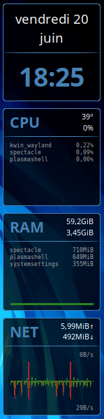
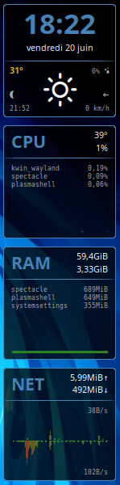
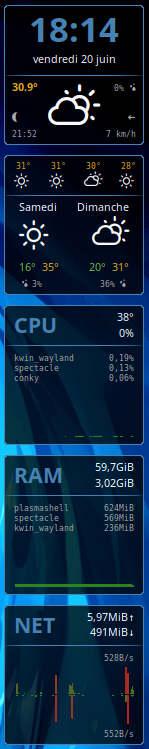
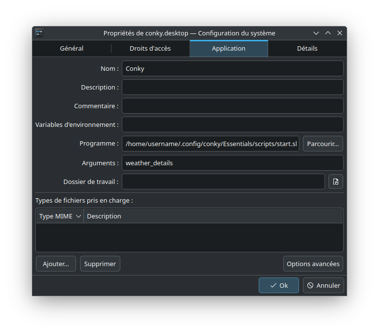

# \[Conky\] Essentials

Essentials is a widget made for [Conky](https://github.com/brndnmtthws/conky) on Linux.  
The goal was to create a simple and functional design that brings together all the essential information about your system.

It comes in 3 variants:

- **no_weather:** date/time, CPU (temperature, usage, top 3 process, usage graph), RAM (free, used, top 3 process, usage graph), NET (upload/download for the current session, current speed, usage graph)
- **weather_simple:** same as *no_weather* plus current weather conditions
- **weather_details:** same as *weather_simple* plus next 4 hours and next 2 days forecasts

      

---

## Installation:

You obviously need to install **Conky** first.  
If you want to display the weather forecast, **lua** and **lua-sec** are required.

Download the widget files to **/home/username/.config/conky/Essentials/**

Make the **start.sh** and **stop.sh** scripts executable:
> `chmod u+x /home/username/.config/conky/Essentials/scripts/start.sh`  
> `chmod u+x /home/username/.config/conky/Essentials/scripts/stop.sh`

---

## Configuration:

Inside the *Essentials* directory, you can find one *.conf* file for each widget variants.

Open the one you want to use with a text editor and change the following lines:

- **temperature_unit = 'celsius':** Change to *Fahrenheit* if necessary
- **${time *format*}:** Change the [format](https://conky.cc/variables#time) to suit your locale
- **${hwmon *module_name* temp *temp_number*}:** Change *module_name* and *temp_number* to display your CPU temperature

> In a terminal, execute `ls /sys/class/hwmon/` to find your modules.  
> Each *hwmon* subdirectories should have a *name* and several *temp_label*.  
> For example, I'm using *${hwmon asusec temp 2}* because:  
> `cat /sys/class/hwmon/hwmon4/name` returns *asusec*  
> `cat /sys/class/hwmon/hwmon4/temp2_label` returns *CPU*

- Find and replace **interface_name** with the name of your network card

> In a terminal, execute `ip addr` to find it. For example: *enp5s0* or *wlan0*

---

## Weather:

**The weather forecast is provided by the [Visual Crossing API](https://www.visualcrossing.com/weather-api/)**

First, install the [Weather Icons font](https://erikflowers.github.io/weather-icons/) from the *erikflowers* GitHub repository or the */weather/fonts/* directory.

Next, go to the [Visual Crossing](https://www.visualcrossing.com/) website and create a free account to get your **API key**.

Finally, open */weather/VisualCrossing/var/settings.lua* with a text editor and change:

- **apiKey**
- **latitude**
- **longitude**
- **lang**
- **units**
- **temperatures:** In *Celsius* by default
- **speedUnit**
- **hourFormat**
- **days:** Translate to your language

The *settings.lua* file contains the necessary explanations.

---

## Usage:

You can start the widget manually from a terminal:

- **no_weather:** `/home/username/.config/conky/Essentials/scripts/start.sh`
- **weather_simple:** `/home/username/.config/conky/Essentials/scripts/start.sh weather_simple`
- **weather_details:** `/home/username/.config/conky/Essentials/scripts/start.sh weather_details`

Or automatically after login with an auto-start entry according to your desktop environment.

---

## Troubleshooting:

If you are using a custom font size or display scaling, you may have to play with *offset* and *aling* values inside the `conky.text = [[ ... ]]` section of the *.conf* files.

You can also change some settings to display the widget on your prefered monitor and position:

    -- Wayland --
        --out_to_x = false,
        --out_to_wayland = true,

    -- Size and position --
        --xinerama_head = 2,
        --alignment = 'top_right',
        --gap_x = 10,
        --gap_y = 5,

*Remove the "--" to uncomment and enable the setting.*

More information on [Conky website](https://conky.cc/config_settings).
